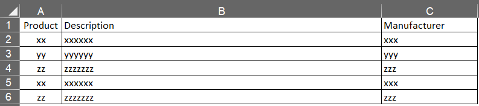

# Bill of materials spreadsheet converter
This is my final project for the CS50's Introduction to Programming with Python
### Video Demo: https://youtu.be/470lgdmxj7g
The project counts how many times a certain product appears in an Excel spreadsheet, converts and exports this data to a JSON file and a PDF document, separating the products according to the manufacturer.

## Spreadsheet format to convert

## Installation and Use
1. Clone the code.
1. Run the command `pip install -r requirements.txt` in the app directory.
2. Than run it: `python3 ./project.py -f file_path.xlsx -s output_file_name`

## Description:
The software must receive two arguments when executed: `-f` with the path to the Excel .xlsx file and `-s` with the name under which you want to save the converted files.
The spreadsheet must be formatted as shown in [Spreadsheet format to convert](#spreadsheet-format-to-convert), with three columns: Product, Description, and Manufacturer.
The software will convert this Excel spreadsheet using the Pandas library, group identical products found in the list, and calculate the total for each of these products.
It will export a JSON file containing all products with their respective totals, grouped by manufacturer.
This file is intended to be imported into other software to automatically purchase products from each supplier.
It will also export a PDF file with all the information contained in the JSON file, also grouped by manufacturer.
The products from each manufacturer are organized in ascending order by product code.
This document is intended to serve as a reference for buyers and also as a verification when the products are delivered.
